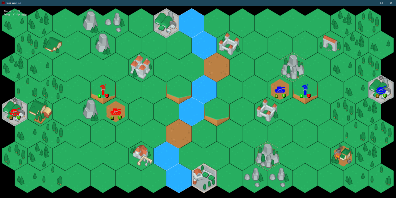
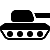
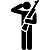
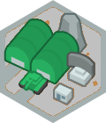
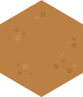
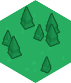
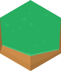
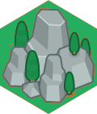
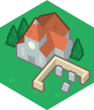
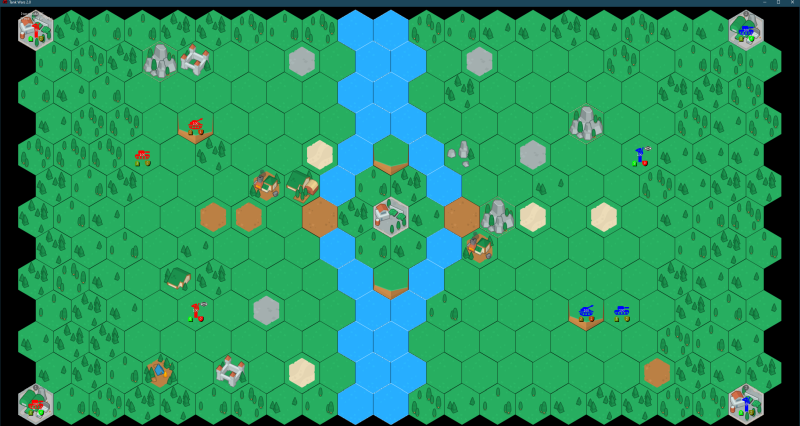

# TankWars2

TankWars2 is a GO implementation in the tradition of [The Gathering's](https://gathering.org) _Hardcore programming
competition_. It is the third challenge after [CloudWars](https://github.com/SchnorcherSepp/CloudWars)
and [SpaceBumper](https://github.com/SchnorcherSepp/SpaceBumper).



## Summary

**TankWars2 presents a unique challenge: develop an Artificial Intelligence (AI) that can navigate the battlefield,
control military units, and conquer enemy bases. In this game, players command a variety of military units, each with
its own strengths and weaknesses. The objective is to dominate the map by capturing bases and eliminating opponent
units.**

The game world is a grid-based battlefield featuring various terrain types, from forests and hills to structures and
water bodies. Units range from artillery and tanks to soldiers, each with specific attributes and capabilities.

Strategically, players must consider unit movement, attack range, terrain bonuses, and supply lines to succeed. The game
offers both single-player and multiplayer modes, allowing you to challenge your AI against others or engage in thrilling
human-vs-human battles.

## How to Play

To embark on your TankWars2 journey, download the GO source code from
[GitHub](https://github.com/SchnorcherSepp/TankWars2/) or grab fully compiled binaries from the
[release page](https://github.com/SchnorcherSepp/TankWars2/releases). The game server simulates the world
and enforces the formal game rules, providing a platform for your AI to compete.

Creating your AI is an exciting part of the challenge. You can write your AI in
the [programming language of your choice](https://github.com/SchnorcherSepp/TankWars2/tree/master/examples) and connect
it to the game server using a simple ASCII protocol over a TCP/IP connection. The formal game rules, including the
protocol details, are available below.

TankWars2 offers various game modes, including AI vs. AI and AI vs. Human. Experiment with different strategies, compete
with others, or refine your AI for the ultimate showdown. Feel free to explore and modify the game simulator to suit
your testing and training needs.

## Units

There are three different unit types available in the game, each with specific roles. The following table illustrates
these roles and presents the basic attributes of the units. Speed are given in iterations: the higher the value, the
longer the action takes. Note that the base attributes are affected by the bonuses of the tile the unit is positioned
on (see the [Tiles](#Tiles) section).

- **View**: Is the unit's normal view range in tiles.
- **Close View**: is the view range in which even hidden units can be spotted in tiles.
- **Armor**: is the armor value of a unit.
- **Fire Range**: is the fire range in tiles.
- **Ammo**: is the maximum ammo that the unit can carry. Ammunition is slowly replenished through supply deports.
- **Speed**: is the movement speed with which you can switch to an adjacent tile. the first half of the time the unit is
  at the start tile. the second half of the time, the unit is already at the target tile, but not yet ready for other
  actions.
- **Fire Speed**: is the flight time of a fired projectile.

| Image                                         | Unit                                                                                                                                                                                                                                              | View | Close View | Armor | Fire Range | Ammo | Speed | Fire Speed |
|-----------------------------------------------|---------------------------------------------------------------------------------------------------------------------------------------------------------------------------------------------------------------------------------------------------|------|------------|-------|------------|------|-------|------------|
|  | **ARTILLERY** - has a particularly long range and is ideal for sieges.                                                                                                                                                                            | 3    | 1          | 1     | 4          | 2    | 150   | 100        |
|            | **TANK** - is very fast and has a high rate of fire. With enough supply it is the strongest unit.                                                                                                                                                 | 3    | 1          | 2     | 2          | 3    | 70    | 60         |
|      | **SOLDIER** - are ideal for use behind enemy lines. Their high ammo makes them less dependent on supplies and there is no terrain they cannot operate on. However, their short range and weak armor forces them to take advantage of the terrain. | 3    | 1          | 0     | 1          | 9    | 90    | 69         |

## Tiles

The table below describes the available tile types and their bonuses for stationed [units](#units). Not all units can
move on every tile type and tile types can also change under fire. A tile can also grant the hidden effect to
certain units.

| Image                                           | Tile                                                                                                                                                                                                                                                                                 | View   | Close View | Armour | Fire Range | Speed    | Hidden Effect       |
|-------------------------------------------------|--------------------------------------------------------------------------------------------------------------------------------------------------------------------------------------------------------------------------------------------------------------------------------------|:-------|------------|--------|------------|----------|---------------------|
|            | **BASE** - provides supply, which decreases with increasing distance (max. 15 fields). The supply refills the ammo of units. When units are stationed on bases, they change hands. They can also be deactivated by shooting at them. Slowly heals health and removes demoralization. | -      | **+2**     | **+2** | _disable_  | -        | -                   |
|            | **DIRT** - offers no bonus or protection whatsoever. Bombing the dirt tile can create a hole tile.                                                                                                                                                                                   | -      | -          | -      | -          | -        | -                   |
|        | **FOREST** - reduces own visibility but camouflages all units. Bombing the forest tile can create a grass tile.                                                                                                                                                                      | **-1** | -          | -      | -          | +20%     | Everyone is hidden  |
|          | **GRASS** - is open space. Only soldiers are hidden in it. Bombing the grass tile can create a dirt tile.                                                                                                                                                                            | -      | -          | -      | -          | -        | Soldiers are hidden |
|            | **HILL** - have high strategic value. They increase all types of range.                                                                                                                                                                                                              | +1     | +1         | -      | +1         | +20%     | -                   |
|            | **HOLE** - can be caused by heavy fire. Units inside have better armor.                                                                                                                                                                                                              | -      | -          | +1     | -          | +20%     | -                   |
|    | **MOUNTAIN** - is only accessible to soldiers, but then they appear like hills.                                                                                                                                                                                                      | +1     | +1         | -      | +1         | **+40%** | -                   |
|  | **STRUCTURE** - is only accessible to soldiers and provides protection and cover. Bombing the structure tile can create a forest tile.                                                                                                                                               | -      | -          | **+2** | -          | -        | Soldiers are hidden |
|          | **WATER** - is only accessible to soldiers. Units cannot shoot from these tiles.                                                                                                                                                                                                     | -      | -          | -      | _disable_  | **+40%** | -                   |

## Combat Mechanics and Consequences

In the game's combat mechanics, units have the ability to engage in attacks against any tile within their `Fire Range`.
Upon
issuing a firing command, a projectile is launched and takes a predefined number of iterations to reach its target tile
(see the `Fire Speed` attribute in the [Units](#units) section).

Upon impact, the damage calculations is initiated, taking into account the attacker's morale state
(demoralized or not) and the armor value of the target unit. The tile itself is also affected by the attack,
potentially resulting in its transformation to a different type.

This dynamic interaction between units and tiles adds an extra layer of strategy and complexity
to the battlefield, where successful attacks not only affect enemy forces but also influence the terrain itself.

### Impact of Attacks on Tiles

The table shows the possible changes in tile types during an attack, along with the corresponding probabilities of each
change. For example, if the target tile is of type BASE, there is a 20% chance that it will be disabled (owner set to 0)
when attacked. Similarly, for each tile type, there is a chance of changing to a different type as specified in the
table.

| Target Tile Type | New Tile Type on Change | Probability of Change |
|------------------|-------------------------|-----------------------|
| BASE             | _disabled_              | 20% per hit           |
| STRUCTURE        | FOREST                  | 10% per hit           |
| FOREST           | GRASS                   | 10% per hit           |
| GRASS            | DIRT                    | 6.67% per hit         |
| DIRT             | HOLE                    | 4% per hit            |

### Statistics and probabilities in damage calculation for a normal attacker

This table provides information about damage calculation for a normal attacker, considering different target armour
levels and the potential impact of the target being demoralized.

The damage calculation process, governed by the `calcDamage()` function in [attack.go](core/attack.go), simulates combat
unpredictability. By using dice
rolling with adjustable sides and numbers of rolls, the function factors in attacker demoralization and target armor. It
computes the damage difference, setting a minimum damage threshold of 3. Critical hits are determined by random flips
against specific damage thresholds. This mechanism introduces variability, mirroring the uncertain nature of combat, and
is summarized in the table's values representing potential damage outcomes based on different target armor levels,
demoralization, and critical hits.

| Target Armour | Minimum Damage | Average Damage | Maximum Damage | Target Demoralized |
|---------------|----------------|----------------|----------------|--------------------|
| 0 Armour      | 3 HP           | 22 HP          | 89 HP          | 21% per hit        |
| 1 Armour      | 3 HP           | 16 HP          | 86 HP          | 12% per hit        |
| 2 Armour      | 3 HP           | 13 HP          | 78 HP          | 7% per hit         |
| 3 Armour      | 3 HP           | 10 HP          | 71 HP          | 5% per hit         |
| 4 Armour      | 3 HP           | 8  HP          | 69 HP          | 3% per hit         |

### Stats for a demoralized attacker

This table provides insight into the damage potential of a demoralized attacker during combat, referencing the
statistics presented in the previous non-demoralized table. The values reflect the variation in damage caused by a
demoralized attacker against different target armor levels.

| Target Armour | Minimum Damage | Average Damage | Maximum Damage | Target Demoralized |
|---------------|----------------|----------------|----------------|--------------------|
| 0  Armour     | 3 HP           | 7 HP           | 54 HP          | 2% per hit         |
| 1  Armour     | 3 HP           | 5 HP           | 48 HP          | 1% per hit         |
| 2  Armour     | 3 HP           | 4 HP           | 45 HP          | 0% per hit         |
| 3  Armour     | 3 HP           | 3 HP           | 39 HP          | 0% per hit         |
| 4  Armour     | 3 HP           | 3 HP           | 41 HP          | 0% per hit         |

## Maps

The following maps are implemented.

| 1v1: Border Dispute (15x08)                                                                                           | 1v1: River Island (21x13)                                                                                                                                 |
|-----------------------------------------------------------------------------------------------------------------------|-----------------------------------------------------------------------------------------------------------------------------------------------------------|
|                                                                              |                                                                                                                    |
| **Reinforcement during iteration:**<br/> 1200: Soldier,<br/>1800: Tank,<br/>3500: Soldier + Artillery,<br/>5000: Tank | **Reinforcement during iteration:**<br/> 1300: 2xSoldier + Artillery,<br/>3500: 2xTank + Artillery,<br/>7000: Soldier + 2xArtillery,<br/>13000: 5xSoldier |

## Formal game rules

### Game Basics

- The game is played in a 2D coordinate system on a hex board.
- The map consists of rows and columns, each starting with 0.
- Since the individual tiles have a hexagonal shape, every second row is shifted half a field to the right, resulting in
  a seamless surface.
- There are three [unit types](#units): artillery, tanks and soldiers.
- Each unit is placed on a tile.
- Only one unit can be placed on each tile.
- There are different [tile types](#tiles) that grant different bonuses and cannot be occupied by every type of unit.
- There are two types of commands: [MOVE](#command-move) and [FIRE](#command-fire).
- When a unit receives a command, it can no longer be canceled and no new command can be received.
- The move command moves the unit to the new space with half its duration. If the tile is not empty at this point, the
  move is immediately stopped.
- The game has a fog of war that hides enemy units but not the terrain.
- Units have a limited supply of ammo, which is slowly replenished with supply (occupied bases).
- The closer you are to your own base, the faster the ammo fills up.
- Neutral or enemy bases can be conquered with your units.
- Attacks can damage units, demoralize them, and also destroy
  terrain: [Combat Mechanics and Consequences](#Combat-Mechanics-and-Consequences)
- The simulator acts as a TCP/IP server, while the players act as TCP/IP clients that connect to the server.
- The game is executed in iterations. When the game starts, the iteration index is zero.
- After the initialization procedure described in the protocol, the simulator then enters a loop executing iterations of
  the game logic until the game is finished.
- The game runs in "real time" with seemingly smooth movements when visualized. However, internally, the simulator runs
  discrete iterations of the game logic, typically locked to 30 iterations per second. What happens for each iteration
  is described below.

### Game iteration loop

The game logic is calculated in the _Update()_ function. It calls sub-functions, which are basically divided into three
files: [update.go](https://github.com/SchnorcherSepp/TankWars2/blob/master/core/update.go),
[stats.go](https://github.com/SchnorcherSepp/TankWars2/blob/master/core/stats.go)
and [attack.go](https://github.com/SchnorcherSepp/TankWars2/blob/master/core/attack.go).
Each iteration corresponds to a call to _Update()_. There are 30 iterations per second.

**Update Loop:**

1) **Set the owner of bases**
    - identifies all supply depots (tile type: BASE) on the world map and assigns
      ownership of the base to whoever has units positioned on the field.
    - Units do not have to remain in the base for ownership to remain.

2) **Update supply levels on the map**
    - calculates and updates the supply network for military bases in a game world.
      The supply network is created by determining which fields can be supplied from each
      own military base within a specified maximum distance. The lower the supply value, the
      closer the field is to a supply depot and the better the supply (1 to 15).
    - The supply network is stored in the form of values within a grid, where each value
      indicates how far the supply network extends from the base. Each Tile's supply data is
      stored using a map, where the key is the player ID and the value is the corresponding
      supply value.

3) **Process MOVE**
    - Every command has a start and an end. The iteration (round) is used to simulate time.
    - MOVE handles the movement of units in the game world. It checks all units on
      the world map to determine if they are currently in the process of moving.
    - If a unit is in the process of moving, it calculates the mid-point of the movement activity and
      determines whether the unit should be moved from its source tile to the destination tile.

4) **Process FIRE**
    - Every command has a start and an end. The iteration (round) is used to simulate time.
    - FIRE handles the attacking of units within the game world. It checks
      all units on the world map to determine if they are engaged in a firing activity.
    - If an attacker is at the end of the firing, the function calculates the outcome of the attack,
      including potential damage to the target tile or unit. An attack always hits the
      terrain itself and all units on the tile.

5) **Spawn reinforcement for players with a base**
    - Reinforcements are defined at certain time intervals in the map configuration (see Reinforcement).
    - As long as a player has a free space with supplies, he can receive reinforcements.

6) **Update unit attributes and ammunition**
    - updates the attributes of all units on the game map based on
      their type, tile, and supply. It calculates and assigns values such as view
      range, armor, firing range, speed, ammunition, and hidden status for each unit.

7) **Heal units in bases**
    - Units located at bases are healed incrementally, and their demoralized status is fixed.

8) **Update visibility ranges for units**
    - updates the visibility of units on the game map based on their attributes (hidden or not).
    - It clears and then recalculates the visibility map for each player's units, taking into
      account the unit's viewing range and other factors.
    - The tiles can have exactly three states for the player: FogOfWar, NormalView and CloseView.
      This is determined by the visibility of the units (attributes view and closeView).

9) **Advance the iteration count**
    - finish the current round and increase the iteration counter

### Command: MOVE

Move initiates a movement command for a unit from one tile to another within the game world.
The function takes three parameters: the starting tile ('from'), the target tile ('to').

If no adjacent tile is specified as the target, pathfinding becomes active and then selects
the correct adjacent tile.

The function performs the following steps:

- Check the validity of the 'from' and 'to' input tiles and the player's eligibility.
- Check if the unit is already performing an activity.
- Check if the 'to' tile is a neighbor of the 'from' tile; if not, use pathfinding.
- Check the target tile's validity based on unit and tile types.
- Create a movement activity command ('Activity') for the unit and mark it as 'busy'.

After that a command ist set. A unit can only have one command at a time.
A command that has been set cannot be canceled or overwritten until it expires.

A command has the following attributes

- Name: Name of the activity (MOVE, FIRE)
- From: Starting coordinates of the activity.
- To: Destination coordinates of the activity.
- Start: Start iteration of the activity.
- End: End iteration of the activity.

The effects of the _MOVE_ command show up right in the middle of START and END. If the target tile is free at this time,
the unit will be moved. If this is not the case, the command aborts and is deleted.

How long the command takes depends on the _Speed_ attribute of the unit.

### Command: FIRE

Fire initiates a firing command for a unit from one tile to another within the game world.
It takes two Tile pointers, 'from' and 'to', as input and processes the following steps:

- It checks the validity of 'from' and 'to' inputs.
- It retrieves the unit associated with the 'from' tile.
- It verifies that the unit is not already processing a command.
- It checks if the 'to' tile is within the firing range of the 'from' tile based on the unit's attributes.
- It checks if the unit has ammunition available for firing.
- It decrements the unit's ammunition count by one.
- It sets a firing command for the unit, specifying the start and end iterations.
- It returns an error if any of the checks fail or if there's an issue with the input.

After that a command ist set. The general rules of a command that were explained under _MOVE_ also apply to this
command.

In the case of _FIRE_, a damage calculation is performed on the target tile at the end of the runtime.
First the terrain is attacked. The odds can be found in the table
[Impact of Attacks on Tiles](#Impact-of-Attacks-on-Tiles).

After that, any unit stationed on the tile will be attacked. The damage can be found in the table
[Statistics and probabilities in damage calculation for a normal attacker](#Statistics-and-probabilities-in-damage-calculation-for-a-normal-attacker)
and [Stats for a demoralized attacker](#Stats-for-a-demoralized-attacker).

If a unit falls to 0 life points,
it is removed. Since an order is tied to a unit, the order also disappears and has no effect.

How long the command takes depends on the _FireSpeed_ attribute of the unit.

## Network protocol specification

### General conventions

1) The client sends a command to the server as a single line of text.
2) It always starts with the command in uppercase, followed by the parameters separated by spaces.
3) The server responds by sending a single line of text.
4) A line of text must always be a string of ASCII characters terminated by a single, unix-style new line character:
   `'\n'`
5) All integers represented as ASCII text.
6) All floating point numbers are represented as ASCII text on the form 13.37
7) The client is always the active party while the server is always the reactive party. The server never sends anything
   without first receiving a command from the client.

### Initialization

The server always waits for a number of players determined by the loaded map.
The first client connect becomes player 1, The second client becomes player 2, and so on.
In order to know which player the current connection corresponds to, this can be queried with a command.

Once alle players are connected, the world becomes un-frozen and the game starts.
Further connections are still possible as observer.
The status of the world should be queried continuously in order to be able to react to changes.

### In-game commands

The following list contains the commands that the client can send to the server, and for each command a list of the
possible responses from the server and their meanings.

#### Command: `PLAYER\n`

Returns the player id of this session. There are six players:

	1: RED
	2: BLUE
	3: GREEN
	4: YELLOW
	5: WHITE
	6: BLACK

A player can only control tanks with the same id set in the owner attribute.

#### Command: `STATUS\n`

GameStatus returns a json with all world data.

```
// World represents the game world with its tiles and dimensions.
type World struct {
   Tiles         [][]*Tile       // Two-dimensional slice of tile pointers representing the world's tiles.
   XWidth        int             // The width of the world in tiles.
   YHeight       int             // The height of the world in tiles.
   Reinforcement map[uint64]byte // reinforcement for all players with a base. key is iteration, value is unit type.
   Iteration     uint64          // Current iteration (game time) of the world.
   Freeze        bool            // if true, the update function has no effect and the world remains frozen
}

// Tile represents a single hexagonal tile within the game world grid.
type Tile struct {
   Type       byte          // tile type (see TILES)
   ImageID    uint8         // ID used by the GUI to display random images
   XCol       int           // Column of the grid
   YRow       int           // Row of the grid
   Unit       *Unit         // Combat unit located on this tile
   Owner      uint8         // Player who last visited the tile
   Visibility map[uint8]int // Visibility level of each player on this tile (FogOfWar, NormalView, CloseView)
   Supply     map[uint8]int // Supply level of each player on this tile
}

// Unit represents a combat unit in the game.
type Unit struct {
   Player      uint8     // Player identifier.
   Type        byte      // Unit type (see UNITS).
   ID          int       // Unique unit identifier.
   Health      int       // Current health points of the unit.
   Activity    *Activity // Current activity the unit is engaged in.
   View        int       // Visibility distance.
   CloseView   int       // Close visibility distance (see hidden).
   FireRange   int       // Firing range distance.
   Speed       uint64    // Movement speed (in game iterations).
   FireSpeed   uint64    // Firing speed (in game iterations).
   Hidden      bool      // Indicates if the unit is hidden.
   Armour      int       // Armor strength.
   Demoralized bool      // Indicates if the unit is demoralized (50% reduced damage).
   Ammunition  float32   // Remaining ammunition count.
}

// Activity represents a unit's ongoing activity or command.
type Activity struct {
   Name  string   // Name of the activity (MOVE, FIRE)
   From  [2]int   // Starting coordinates of the activity.
   To    [2]int   // Destination coordinates of the activity.
   Start uint64   // Start iteration of the activity.
   End   uint64   // End iteration of the activity.
}
```

#### Command: `FIRE x1 y1 x2 y2\n`

The fire command requires the x1,y1 coordinates of the starting tile (and therefore the unit on this tile)
and the x2,y2 coordinates of the target tile.

see [FIRE](#command-fire)

#### Command: `MOVE x1 y1 x2 y2\n`

The movement command requires the x1,y1 coordinates of the starting tile (and therefore the unit on this tile)
and the x2,y2 coordinates of the destination tile.

see [MOVE](#command-move)

### Example: World JSON

```json
{
  "XWidth": 15,
  "YHeight": 8,
  "Iteration": 477,
  "Freeze": false,
  "Reinforcement": {
    "800": 85,
    "1300": 84
  },
  "Tiles": [
    [
      {
        "Type": 70,
        "ImageID": 82,
        "XCol": 0,
        "YRow": 0,
        "Unit": null,
        "Owner": 0,
        "Visibility": {
        },
        "Supply": {
          "1": 4
        }
      },
      {
        "Type": 66,
        "ImageID": 72,
        "XCol": 0,
        "YRow": 4,
        "Unit": {
          "Player": 1,
          "Type": 65,
          "ID": 6180051878395004429,
          "Health": 100,
          "Activity": null,
          "View": 3,
          "CloseView": 3,
          "FireRange": 0,
          "Speed": 150,
          "FireSpeed": 100,
          "Hidden": false,
          "Armour": 3,
          "Demoralized": false,
          "Ammunition": 2
        },
        "Owner": 1,
        "Visibility": {
          "1": 2
        },
        "Supply": {
          "1": 1,
          "2": 15
        }
      },
      {
        "Type": 79,
        "ImageID": 34,
        "XCol": 4,
        "YRow": 4,
        "Unit": {
          "Player": 1,
          "Type": 84,
          "ID": 1624642691181721799,
          "Health": 100,
          "Activity": {
            "Name": "FIRE",
            "From": [
              4,
              4
            ],
            "To": [
              5,
              4
            ],
            "Start": 405,
            "End": 465
          },
          "View": 3,
          "Close View": 1,
          "FireRange": 2,
          "Speed": 84,
          "FireSpeed": 60,
          "Hidden": false,
          "Armour": 3,
          "Demoralized": false,
          "Ammunition": 1.5458264
        },
        "Owner": 0,
        "Visibility": {
          "1": 2
        },
        "Supply": {
          "1": 4,
          "2": 11
        }
      },
      {
        "Type": 71,
        "ImageID": 230,
        "XCol": 5,
        "YRow": 3,
        "Unit": {
          "Player": 1,
          "Type": 85,
          "ID": 8704749214954170023,
          "Health": 100,
          "Activity": {
            "Name": "MOVE",
            "From": [
              5,
              3
            ],
            "To": [
              6,
              3
            ],
            "Start": 374,
            "End": 464
          },
          "View": 3,
          "CloseView": 1,
          "FireRange": 1,
          "Speed": 90,
          "FireSpeed": 69,
          "Hidden": true,
          "Armour": 0,
          "Demoralized": false,
          "Ammunition": 9
        },
        "Owner": 0,
        "Visibility": {
          "1": 2
        },
        "Supply": {
          "1": 6,
          "2": 9
        }
      }
    ]
  ]
}
```
